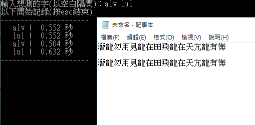

# 單字測速
用法 (以嘸蝦米輸入法為例)：

1. 先準備一段文字，等等才有東西好輸入。當然其中要包含你想測的字。
2. 打開程式，輸入想測的字碼。如龍可拆ALV或LUL，你想比較哪種拆法你打起來會比較順。
3. 隨便找個文字編輯器開始打你準備好的內容。在打的過程中程式會同步顯示結果，可以邊打邊看，或打完再回來看。
4. 目前僅適用以空白鍵上字的輸入法。  
  
  
---
## Dependencies:  
- pip install keyboard
